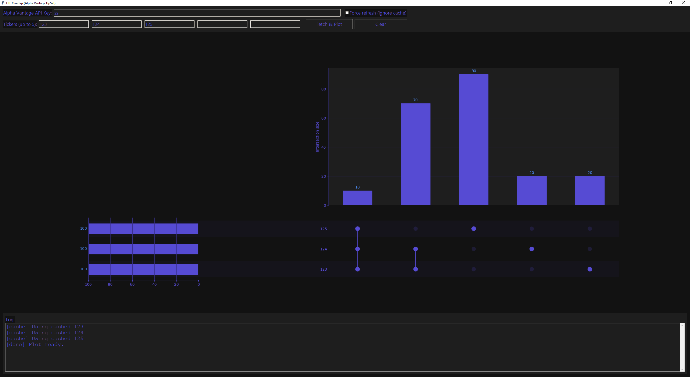
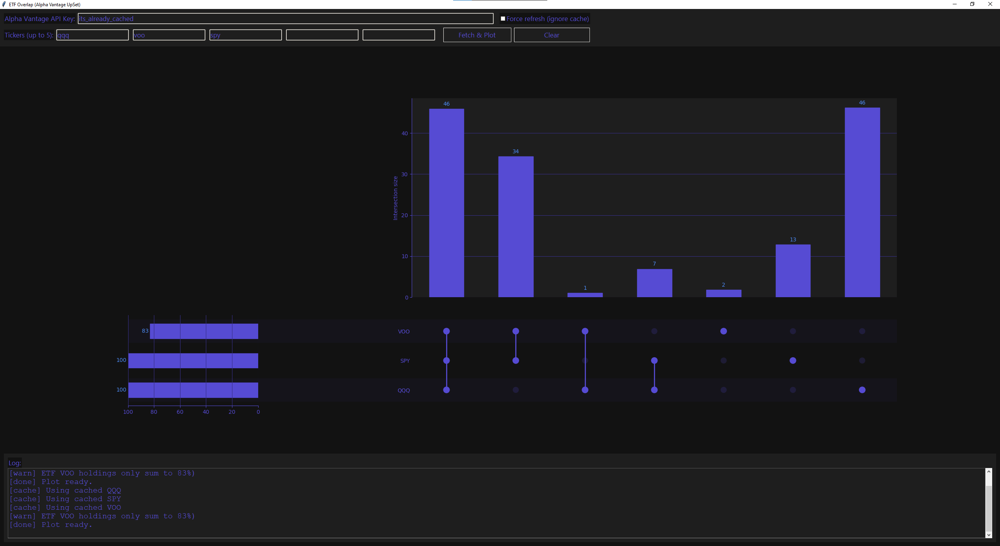

# upsETF
Visualizing weighted ETF overlap with an upset plot.

upsETF takes into account the weight any holding has in a given ETF. For example, if ETF1 has a 7% allocation in `META`, ETF2 has a 14% allocation in `META`, and ETF3 has a 20% allocation in `META`:
* The three-way intersetion is the minimum of the three values
* The intersection between ETF1 and ETF2 only is 0% (already taken into account by the three-way intersection)
* The intersection between ETF2 and ETF3 is the minimum of the remaining weight (14% - 7% from three-way)
* The intersection of ETF3 alone has the remaining weight (20% - 7% - 7% = 6%).

## Thanks chatGPT
GUI by chatgpt to make the interface call dummy functions. ETF weight overlap written by me.

## Alpha Vantage API
Get your AlphaVantage API key [here](https://www.alphavantage.co/support/#api-key). You are limited to 25 calls per day (each unique ETF you want to compare is one call). To help with this, upsETF caches each ETF API call.

## Installation
1. Install Python
2. Execute `python -m venv .env`

## Usage
### Windows
1. Execute `\.env\Scripts\activate.ps1`

### Linux 
1. Execute `source venv/bin/activate`

### All
2. Execute `python upsetf_app.py`
3. (optional) Enter your AlphaVantage API key if you know you will be querying for a non-cached ETF.
4. (optional) Check the "Force refresh" box to get new data even if it's cached.
4. Input up to 5 ETF tickers
5. Click "Fetch & Plot"
6. Repeat from #3.

## Test data
Test data with simple allocations are included in the data folder as if it were cached. The tickers for the fake ETFs are `ABX`, `ABY`, and `ABZ`.

```json
{
  "net_assets": "385800000000",
  "net_expense_ratio": "0.002",
  "portfolio_turnover": "0.08",
  "dividend_yield": "0.0046",
  "inception_date": "1999-03-10",
  "leveraged": "NO",
  "holdings": [
    {
      "symbol": "NVDA",
      "description": "NVIDIA CORP",
      "weight": "0.2"
    },
    {
      "symbol": "BAR",
      "description": "BAR",
      "weight": "0.6"
    },
    {
      "symbol": "BAZ",
      "description": "BAZ",
      "weight": "0.2"
    }
  ],
  "ticker": "ABX",
  "fetched_at": "2025-11-07T19:47:19.687683"
}
```



## QQQ vs. SPY vs. VOO

